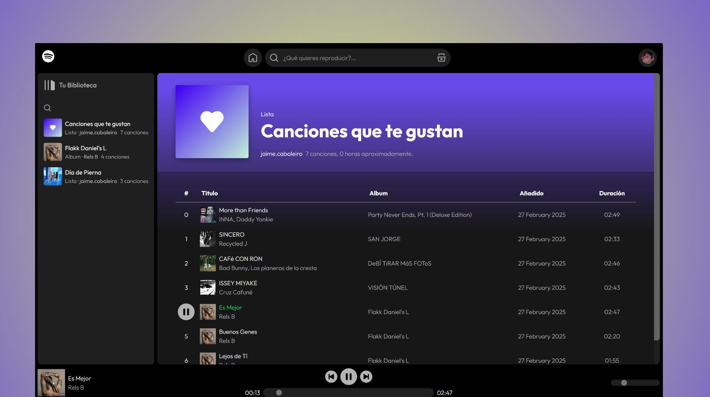

# SPOTIFY (clone)



Ya que es una de las aplicaciones que mas utilizo en el día a día durante mi tiempo libre, decidí utilizarla como ejemplo de ejercicio de programación, intentando semejarme lo máximo posible a mi perfil actual.

Para este proyecto, he extraido los elementos svg para poder acercarme lo máximo posible y he intentado utilizar la misma estructura de datos que utiliza la web. Para esto estuve indagando en su api que podreis ver a continuación ([link para la información de usuario,playlists, etc...](https://developer.spotify.com/documentation/web-api) y por otro lado [link para el reproductor](https://developer.spotify.com/documentation/web-playback-sdk) (esto lo dejo aquí para una posible actualización del proyecto)), pero desafortunadamente no la pude utilizar directamente dado que no cuento con una cuenta premium, lo que me imposibilitaba traerme la fuente de audio de las canciones y álbumes. Igualmente como he comentando he intentado utilizar la misma estructura utilizando solo los elementos y datos que queria replicar.

Fuente de audio sacada de Youtube Studio.

## ⚒️ Instalación

Lo primero que tendremos que hacerlo sera descargar el repositorio de github, una vez dentro del el instalaremos las dependecias.

> [!NOTE]  
> Es necesario primero tener instalado git y node.

```bash
git clone https://github.com/jaimecapo/my-portfolio.git
cd my-portfolio/
npm install
```

Listo, ya podríamos desplegar el proyecto. Para ello ejecutaremos en la raiz de este:

```bash
npm run dev
```

## 💻 Vista del proyecto.

Para ver imagenes de visualización de la web, dirigete a [doc/views.md](/doc/views.md) o entra en el enlace.

## 🚀 Estructura del proyecto.

Inside of your Astro project, you'll see the following folders and files:

```text
/.
│   .gitignore
│   .prettierrc.mjs
│   astro.config.mjs
│   package-lock.json
│   package.json
│   README.md
│   tsconfig.json
|
├───doc
│   │   play-icon.svg
│   │
│   ├───img
│           header-image.png
│           like-songs.png
│           playlist-preview.png
│
├───public
│   │   favicon.svg
│   │
│   └───audios
│           Candy Apple Blue - Surf Ninja 3.mp3
│           Chichadoodledoo - Surf Ninja 3.mp3
│           Darqueness - Surf Ninja 3.mp3
│           El Dogfather - Surf Ninja 3.mp3
│           House of Mango - Surf Ninja 3.mp3
│           Jumpin Off - Surf Ninja 3.mp3
│           No Flubs - Surf Ninja 3.mp3
│           Regular Fun - Surf Ninja 3.mp3
│           Shady Guy - Surf Ninja 3.mp3
│           Sweaty Linen - Surf Ninja 3.mp3
│
└───src
  ├───components
  │   │   BtnLupa.tsx
  │   │
  │   ├───biblioteca
  │   │       Biblioteca.tsx
  │   │       BibliotecaItem.tsx
  │   │
  │   ├───player
  │   │   │   Player.tsx
  │   │   │   PlayerHeader.tsx
  │   │   │   Slider.tsx
  │   │   │
  │   │   └───controlers
  │   │           NextBtn.tsx
  │   │           PlayBtn.tsx
  │   │           PlayControler.tsx
  │   │           ProgressControler.tsx
  │   │           VolumeControler.tsx
  │   │
  │   ├───playlists
  │   │   │   SongItem.tsx
  │   │   │   SongsList.tsx
  │   │   │
  │   │   └───visualizers
  │   │           EmptyVisualizer.astro
  │   │           LittleVisualizer.astro
  │   │           MediumVisualizer.astro
  │   │
  │   └───searcher
  │           SearchList.tsx
  │           SearchOptions.tsx
  │           SearchPanel.tsx
  │
  ├───layouts
  │       Layout.astro
  │
  ├───lib
  │       data.ts
  │
  ├───pages
  │   │   index.astro
  │   │
  │   └───playlists
  │           [id].astro
  │
  ├───styles
  │       global.css
  │
  └───utils
      timeConversions.ts
```

Estructura del proyecto
